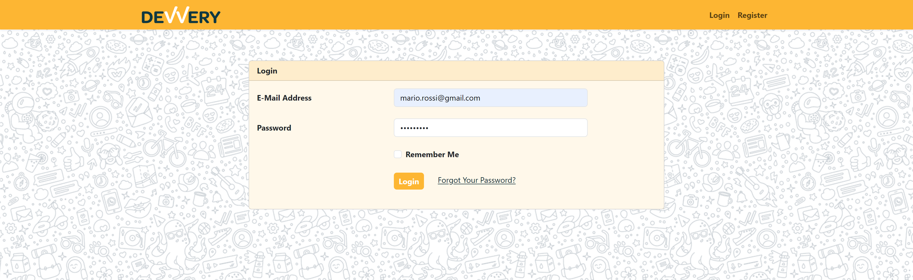

Progetto svolto in collaborazione ad altre quattro studenti durante il mio percorso in boolean.

Il backend di Devvery gestisce la logica di business, la gestione dei dati e la comunicazione con il frontend dell'applicazione. Utilizziamo il framework PHP Laravel per sviluppare il backend, sfruttando le sue potenti funzionalità per creare un'API robusta e scalabile.

#### Implementazioni Backend e Tecnologie Utilizzate:

- **Laravel Framework:** Abbiamo scelto Laravel come framework principale per lo sviluppo del backend di Devvery. Laravel fornisce un'architettura chiara e ben strutturata, insieme a numerose funzionalità che semplificano lo sviluppo di applicazioni web complesse. Utilizziamo le funzionalità di routing, autenticazione, gestione delle richieste HTTP e molto altro fornite da Laravel.

- **Gestione dei Dati:** MySQL è stato utilizzato per memorizzare e gestire tutti i dati relativi agli utenti, ai ristoranti, ai piatti disponibili, agli ordini e alle transazioni di pagamento. Abbiamo progettato il database utilizzando MySQL Workbench o strumenti simili per definire lo schema dei dati, le tabelle e le relazioni tra di esse.

- **API:** Sviluppiamo un'API RESTful per consentire al frontend di comunicare con il backend in modo efficiente. Utilizziamo le risorse di Laravel per definire le rotte API e gestire le richieste HTTP in entrata e in uscita.

- **Gestione degli Utenti e dell'Autenticazione:** Utilizziamo il sistema di autenticazione integrato di Laravel per gestire l'autenticazione degli utenti. Consentiamo agli utenti di registrarsi, effettuare il login e gestire il proprio account utilizzando le funzionalità fornite da Laravel, come le migrazioni e i seeders per la gestione del database degli utenti.

- **Integrazione con Braintree per il Sistema di Pagamento:** Integriamo il servizio di pagamento Braintree nel backend utilizzando la libreria ufficiale fornita da Laravel. Configuriamo le credenziali di accesso e utilizziamo le API di Braintree per elaborare le transazioni di pagamento in modo sicuro e affidabile.

- **Gestione delle Richieste HTTP:** Utilizziamo il middleware di Laravel per gestire le richieste HTTP in entrata e in uscita. Implementiamo controllori per gestire le diverse operazioni richieste dal frontend, come la gestione degli ordini, la ricerca dei ristoranti e la gestione dei piatti disponibili.

Complessivamente, utilizzando il framework Laravel per lo sviluppo del backend, garantiamo un'architettura solida e ben strutturata per Devvery. Integrando le funzionalità di autenticazione, gestione dei dati e comunicazione con Braintree per il sistema di pagamento, forniamo un backend robusto e scalabile per supportare le funzionalità complesse dell'applicazione Devvery.

### Pagina Login

### Pagina Iniziale

### Piatti del ristorante

### Ordini ricevuti

### Ordini Evasi

### Statistiche

